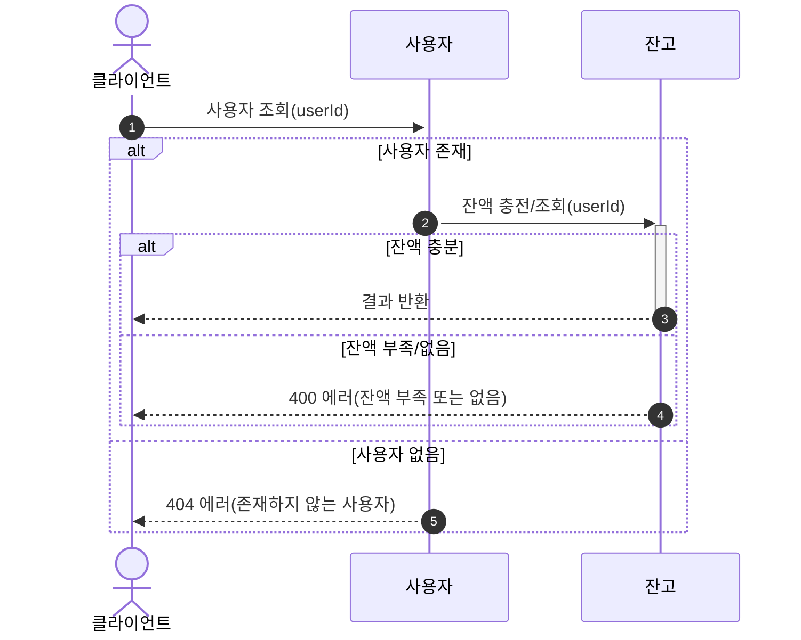
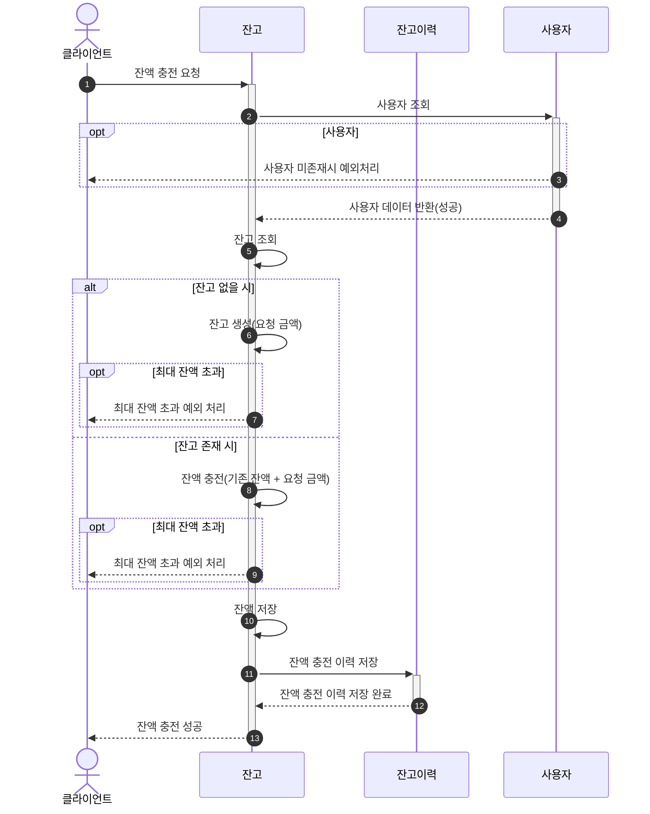
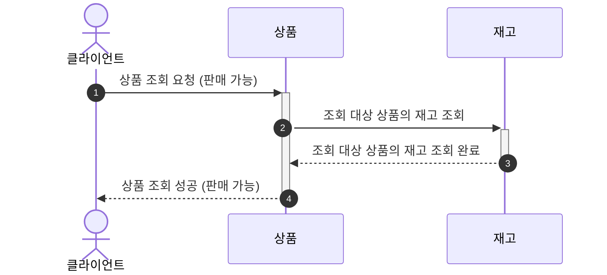
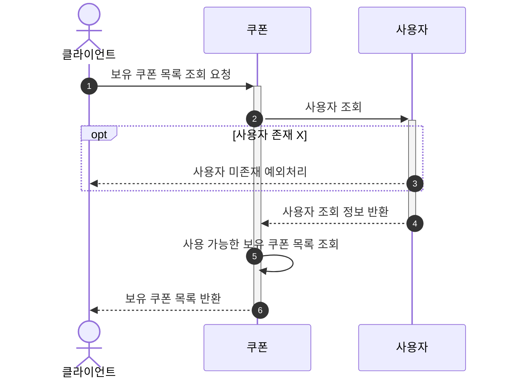
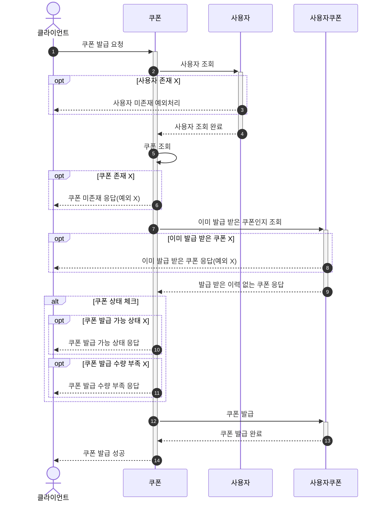
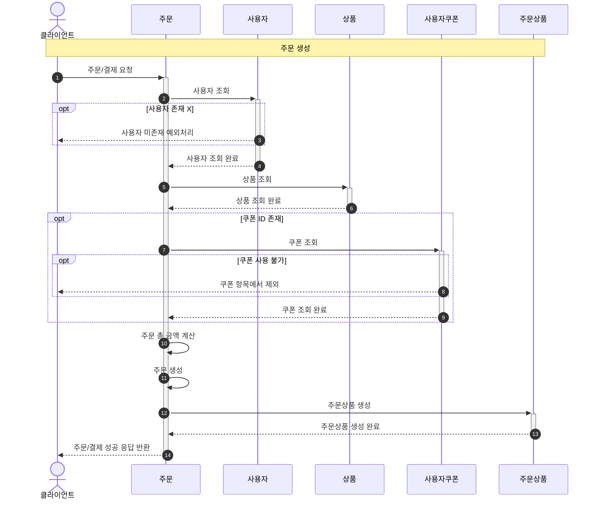
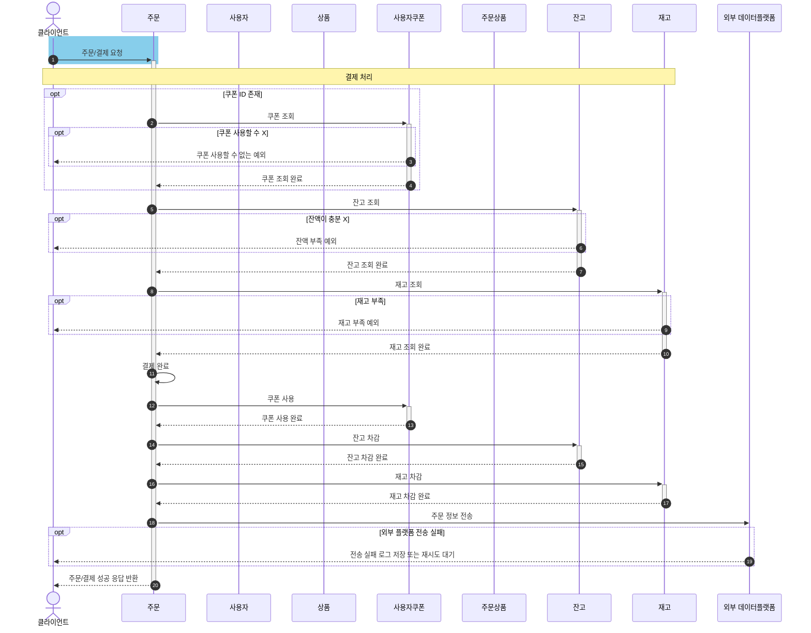
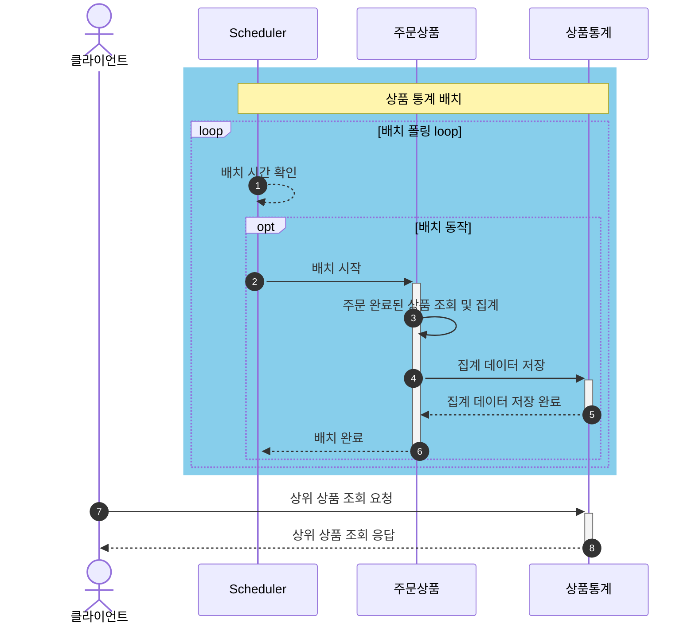

# e-커머스 상품 주문 서비스

## 문서 목록

## 목차
1. [잔고](#잔고balance)
    - [잔액 조회](#잔액-조회)
    - [잔액 충전](#잔액-충전)
2. [상품](#상품-product)
    - [상품 조회](#상품-조회)
3. [쿠폰](#쿠폰)
    - [보유 쿠폰 목록 조회](#보유-쿠폰-목록-조회)
    - [쿠폰 발급](#쿠폰-발급)
4. [주문 및 결제](#주문-및-결제)
    - [주문 및 결제 완료](#주문-생성)
    - [결제 처리](#결제-처리)
5. [상품 랭킹](#상품-랭킹)
    - [상품 랭킹 배치 프로세스 및 조회](#상품-랭킹-배치-프로세스-및-조회)

---

## 잔고(Balance)
### 잔액 조회

**설명 (Description)**
- (1) : 클라이언트가 잔액 조회를 요청한다.
- (2)-(4) : 사용자 잔고를 조회하며, 잔고가 있으면 잔고의 금액을 잔고가 없으면 0을 클라이언트에게 반환한다.
- (5) : 사용자 검증을 진행하며, 검증 실패시 예외가 발생한다.

### 잔액 충전

**설명 (Description)**

- (1) : 클라이언트가 잔액 충전을 요청한다.
- (2)-(4) : 사용자 검증을 진행하며, 검증 실패시 에러
- (5) : 잔고를 조회한다.
- (6)-(9) : 잔고가 있으면 기존 잔고에 충전 요청 금액을 더하고 없으면 요청 금액으로 잔고를 새로 생성한다
- (7), (9) : 이때 잔고의 최대 금액을 넘으면 최대 잔액 초과 예외가 발생한다.
- (10) : 충전한 잔액을 저장한다.
- (11)-(12) : 잔액 충전이력에 저장한다.
- (13) : 잔액 충전에 성공을 클라이언트에게 응답한다.

---

## 상품 (Product)

### 상품 조회

**설명 (Description)**

+ (1) : 클라이언트가 판매 가능(SELLABLE)한 상품을 조회한다.
+ (2)-(3) : 조회 대상 상품의 재고를 조회한다.
+ (4) : 조회한 판매 가능 상품을 클라이언트에 전달한다.

---

## 쿠폰

### 보유 쿠폰 목록 조회

+ (1) : 클라이언트가 보유 쿠폰 목록을 조회 요청한다.
+ (2)-(4) : 사용자 검증을 진행하며, 검증 실패시 에러
+ (5) : 사용 가능한 보유 쿠폰 목록을 조회한다.
+ (6) : 조회한 쿠폰 목록을 클라이언트에게 반환한다.

### 쿠폰 발급

+ (1) : 클라이언트가 쿠폰 발급 조회 요청한다.
+ (2)-(4) : 사용자 검증을 진행하며, 검증 실패시 에러 응답 반환
+ (5)-(6) : 쿠폰 발급을 위한 쿠폰 식별자로 쿠폰을 조회한다. 존재하지 않으면, 에러 응답 반환
+ (7)-(9) : 이미 발급 받은 쿠폰이 있는지 조회한다.
+ (10)-(11) : 쿠폰 발급 상태가 아니거나, 쿠폰 발급 수량이 존재하지 않으면 실패
+ (12)-(13) : 쿠폰을 발급한다.
+ (14) : 쿠폰 발급 성공을 클라이언트에게 반환한다.

---

## 주문 및 결제

### 주문 생성 

**주문 생성**
+ (1) : 클라이언트가 주문 및 결제를 요청한다.
+ (2)-(4) : 사용자 검증을 진행하며, 검증 실패시 에러 응답 반환
+ (5)-(6) : 존재하는지 상품을 확인하며, 상품이 없으면 실패. 상품 목록의 크기 만큼 반복한다.
+ (7)-(9) : 쿠폰이 존재하면, 쿠폰을 검증하고 검증 에러시 실패한다. 
+ (10)-(14) : 주문 총 금액을 계산하고, 주문 생성 그리고 주문 상품을 생성한다.

### 결제 처리

**결제 처리**
+ (2)-(4) : 쿠폰 사용 가능하다면, 쿠폰을 사용한다. (쿠폰 상태가 결제 직전 다시 변경될 수 있으므로(시간 변경 등), 결제 단계에서 상태 재검증을 위한 재조회 수행)
+ (5)-(7) : 잔고를 조회 후 차감하며, 주문 금액보다 충분하지 않으면 예외가 발생한다. 
+ (8)-(10) : 재고의 검증을 진행하며, 충분한 재고가 있다면 재고를 차감한다. 
+ (11)-(17) : 결재 처리 - 쿠폰 차감, 잔고 차감, 재고 차감
+ (18)-(19) : 결제 완료까지 마치면, 외부 데이터플랫폼에 주문정보를 전송한다. 
+ (20) : 클라이언트에게 주문 성공 응답을 반환한다. 

---

## 상품 랭킹

### 상품 랭킹 배치 프로세스 및 조회

**(1)-(6) : 통계 배치**
+ (1) : 배치가 초 간격으로 시간을 확인한다. 
+ (2) : 배치 시간이 되면, 배치 프로세스를 시작한다.
+ (3)-(5) : 하루 전의 결제 완료된 주문의 상품 개수를 집계하여 데이터를 저장한다. 
+ (6) : 배치 프로세스를 완료한다.

**(7)-(8) : 클라이언트 요청**
+ (7) : 클라이언트가 상위 상품 조회를 요청한다.
+ (8) : 클라이언트 요청 시, 사전 집계된 랭킹 데이터를 반환한다. (캐싱 전략 포함 가능)