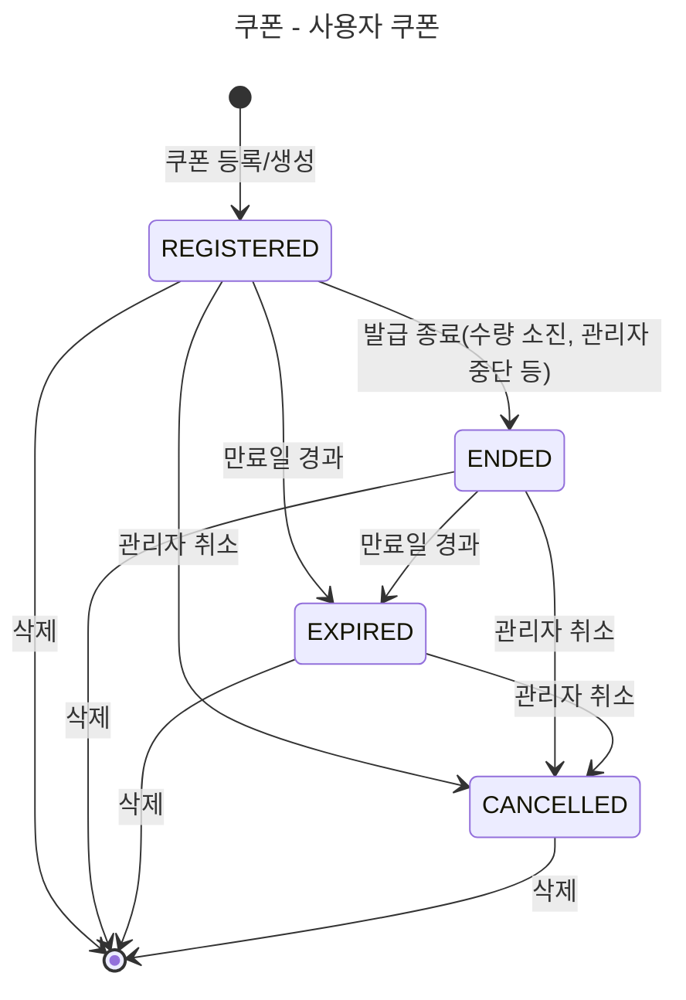
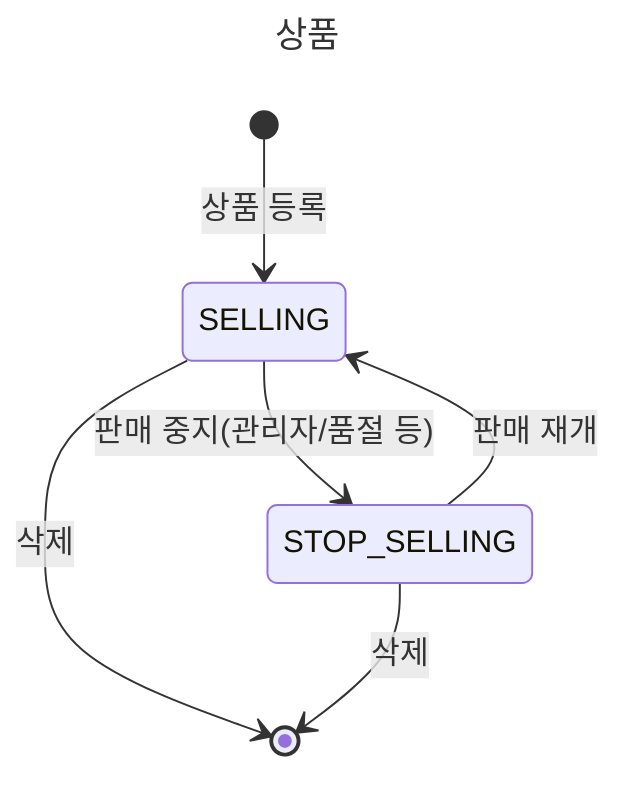
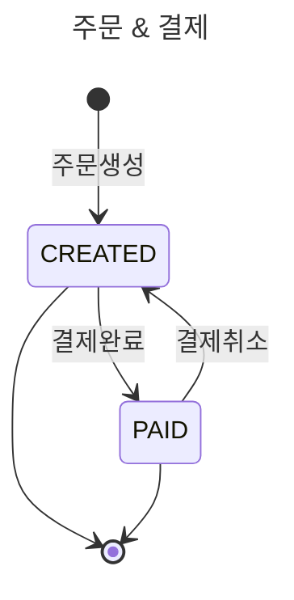

# E-커머스 상태 다이어그램

**📚 문서 목록**

+ [1️⃣ 요구사항 분석 문서](00.Requirements.md)
+ [2️⃣ 마일스톤 문서](01.Milestones.md)
+ 3️⃣ 다이어그램 문서
  + [시퀀스 다이어그램 문서](02-1.SequenceDiagram.md)
  + [상태 다이어그램 문서](02-2.StateDiagram.md)
+ [4️⃣ ERD 문서](03.ERD.md)
+ [5️⃣ API 명세](04.ApiDocument.md)

---

<!-- TOC -->
* [E-커머스 상태 다이어그램](#e-커머스-상태-다이어그램)
  * [쿠폰 상태](#쿠폰-상태)
    * [설명 (Description)](#설명-description)
  * [판매 상태](#판매-상태)
    * [다이어그램 (Diagram)](#다이어그램-diagram)
    * [설명 (Description)](#설명-description-1)
  * [주문 상태](#주문-상태)
    * [다이어그램 (Diagram)](#다이어그램-diagram-1)
    * [설명 (Description)](#설명-description-2)
<!-- TOC -->

## 쿠폰 상태

### 설명 (Description)

**쿠폰**

+ `REGISTERED` : 관리자에 의해 쿠폰이 등록된다. 등록시 유효기간이 함께 추가된다.
+ `ENDED` : 쿠폰 기간이 만료되거나 관리자가 쿠폰 사용을 종료한다.
+ `EXPIRED` : 쿠폰의 상태값은 유지되지만, 유효기간 초과 시 만료로 간주된다. (실제 발급되지만 사용은 제한됨)
+ `CANCELED` : 관리자에 쿠폰이 취소된다.

## 판매 상태

### 다이어그램 (Diagram)

### 설명 (Description)

**상품**

+ `SELLING` : 관리자에 의해 상품이 **판매중** 상태로 등록
+ `STOP_SELLING` : 판매 중지된 상태, 관리자에 의해 다시 `SELLING` 상태로 변경 가능

## 주문 상태

### 다이어그램 (Diagram)

### 설명 (Description)

**주문**

+ `CREATED` : 사용자가 주문을 생성하면 결제 대기 상태로 전환
+ `PAID` : 결제가 정상적으로 완료, 이후 결제 취소 시 `CREATED` 상태로 되돌아간다.