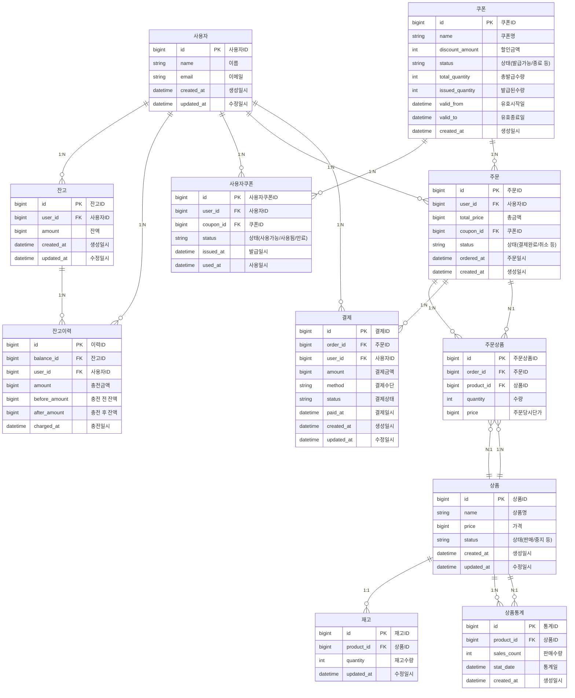

# e-커머스 상품 주문 서비스

## 문서 목록

## 목차

## ERD 작성

## 상태 및 타입 정의 (Status & Type)

### 1. 거래 타입 (TransactionType)

잔고 변동(충전, 사용 등) 이력에 사용되는 거래 타입입니다.

| 값      | 설명         |
|---------|--------------|
| CHARGE  | 잔액 충전    |
| USE     | 잔액 사용    |

---

### 2. 상품 상태 (ProductStatus)

| 값         | 설명         |
|------------|--------------|
| SELLABLE   | 판매 가능    |
| UNSELLABLE | 판매 중지    |

---

### 3. 쿠폰 상태 (CouponStatus)

| 값        | 설명           |
|-----------|----------------|
| PUBLISHABLE  | 발급 가능      |
| ENDED     | 발급 종료      |
| EXPIRED   | 만료           |

---

### 4. 사용자쿠폰 상태 (UserCouponStatus)

| 값        | 설명           |
|-----------|----------------|
| UNUSED | 사용 가능      |
| USED      | 사용 완료      |
| EXPIRED   | 만료           |

---

### 5. 주문 상태 (OrderStatus)

| 값        | 설명           |
|-----------|----------------|
| PAID      | 결제 완료      |
| CANCELLED | 주문 취소      |
| PENDING   | 결제 대기      |

---

### 6. 결제 수단 (PaymentMethod)

| 값      | 설명         |
|---------|--------------|
| BALANCE | 잔고 결제    |
| CARD    | 카드 결제    |
| PG      | 외부 PG사    |

---

### 7. 결제 상태 (PaymentStatus)

| 값        | 설명           |
|-----------|----------------|
| READY   | 결제 준비      |
| WAITING   | 결제 대기      |
| SUCCESS   | 결제 성공      |
| FAILED    | 결제 실패      |
| CANCELLED | 결제 취소      |

---

### 8. 기타 참고

- **거래 타입(TransactionType)**은 잔고이력(충전, 사용, 환불 등)에 필수적으로 사용됩니다.
- **상태/타입 값**은 서비스의 비즈니스 로직과 확장성에 따라 추가/수정될 수 있습니다.
- 실제 구현 시에는 각 언어나 프레임워크의 enum, 상수, 코드 테이블 등으로 관리하면 됩니다.