# e-커머스 상품 주문 서비스

**📚 문서 목록**

+ [1️⃣ 요구사항 분석 문서](00.Requirements.md)
+ [2️⃣ 마일스톤 문서](01.Milestones.md)
+ 3️⃣ 다이어그램 문서
  + [시퀀스 다이어그램 문서](02-1.SequenceDiagram.md)
  + [상태 다이어그램 문서](02-2.StateDiagram.md)
+ [4️⃣ ERD 문서](03.ERD.md)
+ [5️⃣ API 명세](04.ApiDocument.md)

## 목차
1. [잔고](#잔고balance)
    - [잔액 조회](#잔액-조회)
    - [잔액 충전](#잔액-충전)
2. [상품](#상품-product)
    - [상품 조회](#상품-조회)
3. [쿠폰](#쿠폰)
    - [보유 쿠폰 목록 조회](#보유-쿠폰-목록-조회)
    - [쿠폰 발급](#쿠폰-발급)
4. [주문 및 결제](#주문-및-결제)
    - [주문 및 결제 완료](#주문-생성)
    - [결제 처리](#결제-처리)
5. [상품 랭킹](#상품-랭킹)
    - [상품 랭킹 배치 프로세스 및 조회](#상품-랭킹-배치-프로세스-및-조회)

---

## 잔고(Balance)
### 잔액 조회

```mermaid
sequenceDiagram
    autonumber
    actor 클라이언트
    participant 사용자
    participant 잔고
    클라이언트->>+ 사용자: 사용자 조회(userId)
    alt 사용자 존재
        사용자->>+ 잔고: 잔액 충전/조회(userId)
        alt 잔액 충분
            잔고-->>-클라이언트: 결과 반환
        else 잔액 부족/없음
            잔고-->>클라이언트: 400 에러(잔액 부족 또는 없음)
        end
    else 사용자 없음
        사용자-->>클라이언트: 404 에러(존재하지 않는 사용자)
    end
```

**설명 (Description)**
- (1) : 클라이언트가 잔액 조회를 요청한다.
- (2)-(4) : 사용자 잔고를 조회하며, 잔고가 있으면 잔고의 금액을 잔고가 없으면 0을 클라이언트에게 반환한다.
- (5) : 사용자 검증을 진행하며, 검증 실패시 예외가 발생한다.

### 잔액 충전

```mermaid
sequenceDiagram
    autonumber
    actor 클라이언트
    participant 잔고
    participant 잔고이력
    participant 사용자
    클라이언트 ->>+ 잔고: 잔액 충전 요청
    잔고 ->>+ 사용자: 사용자 조회

    opt 사용자 
        사용자 -->> 클라이언트: 사용자 미존재시 예외처리
    end

    사용자 -->>- 잔고: 사용자 데이터 반환(성공)
    잔고 ->> 잔고: 잔고 조회

    alt 잔고 없을 시
        잔고 ->> 잔고: 잔고 생성(요청 금액)
        opt 최대 잔액 초과
            잔고 -->> 클라이언트: 최대 잔액 초과 예외 처리
        end
    else 잔고 존재 시
        잔고 ->> 잔고: 잔액 충전(기존 잔액 + 요청 금액)
        opt 최대 잔액 초과
            잔고 -->> 클라이언트: 최대 잔액 초과 예외 처리
        end
    end

    잔고 ->> 잔고: 잔액 저장
    잔고 ->>+ 잔고이력: 잔액 충전 이력 저장
    잔고이력 -->>- 잔고: 잔액 충전 이력 저장 완료
    잔고 -->>- 클라이언트: 잔액 충전 성공
```

**설명 (Description)**

- (1) : 클라이언트가 잔액 충전을 요청한다.
- (2)-(4) : 사용자 검증을 진행하며, 검증 실패시 에러
- (5) : 잔고를 조회한다.
- (6)-(9) : 잔고가 있으면 기존 잔고에 충전 요청 금액을 더하고 없으면 요청 금액으로 잔고를 새로 생성한다
- (7), (9) : 이때 잔고의 최대 금액을 넘으면 최대 잔액 초과 예외가 발생한다.
- (10) : 충전한 잔액을 저장한다.
- (11)-(12) : 잔액 충전이력에 저장한다.
- (13) : 잔액 충전에 성공을 클라이언트에게 응답한다.

---

## 상품 (Product)

### 상품 조회

```mermaid
sequenceDiagram
    autonumber
    actor 클라이언트
    participant 상품
    participant 재고
    클라이언트 ->>+ 상품: 상품 조회 요청 (판매 가능)
    상품 ->>+ 재고: 조회 대상 상품의 재고 조회
    재고 -->>- 상품: 조회 대상 상품의 재고 조회 완료
    상품 -->>- 클라이언트: 상품 조회 성공 (판매 가능)
```

**설명 (Description)**

+ (1) : 클라이언트가 판매 가능(SELLABLE)한 상품을 조회한다.
+ (2)-(3) : 조회 대상 상품의 재고를 조회한다.
+ (4) : 조회한 판매 가능 상품을 클라이언트에 전달한다.

---

## 쿠폰

### 보유 쿠폰 목록 조회

```mermaid
sequenceDiagram
    autonumber
    actor 클라이언트
    participant 쿠폰
    participant 사용자
    클라이언트 ->>+ 쿠폰: 보유 쿠폰 목록 조회 요청
    쿠폰 ->>+ 사용자: 사용자 조회

    opt 사용자 존재 X
        사용자 -->> 클라이언트: 사용자 미존재 예외처리
    end

    사용자 -->>- 쿠폰: 사용자 조회 정보 반환
    쿠폰 ->> 쿠폰: 사용 가능한 보유 쿠폰 목록 조회
    쿠폰 -->>- 클라이언트: 보유 쿠폰 목록 반환
```

+ (1) : 클라이언트가 보유 쿠폰 목록을 조회 요청한다.
+ (2)-(4) : 사용자 검증을 진행하며, 검증 실패시 에러
+ (5) : 사용 가능한 보유 쿠폰 목록을 조회한다.
+ (6) : 조회한 쿠폰 목록을 클라이언트에게 반환한다.

### 쿠폰 발급

```mermaid
sequenceDiagram
    autonumber
    actor 클라이언트
    participant 쿠폰
    participant 사용자
    participant 사용자쿠폰
    클라이언트 ->>+ 쿠폰: 쿠폰 발급 요청
    쿠폰 ->>+ 사용자: 사용자 조회

    opt 사용자 존재 X
        사용자 -->> 클라이언트: 사용자 미존재 예외처리
    end

    사용자 -->>- 쿠폰: 사용자 조회 완료
    쿠폰 ->> 쿠폰: 쿠폰 조회

    opt 쿠폰 존재 X
        쿠폰 -->> 클라이언트: 쿠폰 미존재 응답(예외 X)
    end

    쿠폰 ->>+ 사용자쿠폰: 이미 발급 받은 쿠폰인지 조회

    opt 이미 발급 받은 쿠폰 X
        사용자쿠폰 -->> 클라이언트: 이미 발급 받은 쿠폰 응답(예외 X)
    end

    사용자쿠폰 -->>- 쿠폰: 발급 받은 이력 없는 쿠폰 응답

    alt 쿠폰 상태 체크
        opt 쿠폰 발급 가능 상태 X
            쿠폰 -->> 클라이언트: 쿠폰 발급 가능 상태 응답
        end    
        opt 쿠폰 발급 수량 부족 X
            쿠폰 -->> 클라이언트: 쿠폰 발급 수량 부족 응답
        end
    end

    쿠폰 ->>+ 사용자쿠폰: 쿠폰 발급
    사용자쿠폰 -->>- 쿠폰: 쿠폰 발급 완료
    쿠폰 -->>- 클라이언트: 쿠폰 발급 성공
```

+ (1) : 클라이언트가 쿠폰 발급 조회 요청한다.
+ (2)-(4) : 사용자 검증을 진행하며, 검증 실패시 에러 응답 반환
+ (5)-(6) : 쿠폰 발급을 위한 쿠폰 식별자로 쿠폰을 조회한다. 존재하지 않으면, 에러 응답 반환
+ (7)-(9) : 이미 발급 받은 쿠폰이 있는지 조회한다.
+ (10)-(11) : 쿠폰 발급 상태가 아니거나, 쿠폰 발급 수량이 존재하지 않으면 실패
+ (12)-(13) : 쿠폰을 발급한다.
+ (14) : 쿠폰 발급 성공을 클라이언트에게 반환한다.

---

## 주문 및 결제

### 주문 생성 

```mermaid
sequenceDiagram
    autonumber
    actor 클라이언트
    participant 주문
    participant 사용자
    participant 상품
    participant 쿠폰 AS 사용자쿠폰
    participant 주문상품

    
    Note over 클라이언트, 주문상품: 주문 생성
    클라이언트 ->>+ 주문: 주문/결제 요청
    주문 ->>+ 사용자: 사용자 조회

    opt 사용자 존재 X
        사용자 -->> 클라이언트: 사용자 미존재 예외처리
    end

    사용자 -->>- 주문: 사용자 조회 완료
    주문 ->>+ 상품: 상품 조회
    상품 -->>- 주문: 상품 조회 완료

    opt 쿠폰 ID 존재
        주문 ->>+ 쿠폰: 쿠폰 조회

        opt 쿠폰 사용 불가
            쿠폰 -->> 클라이언트: 쿠폰 항목에서 제외
        end

        쿠폰 -->>- 주문: 쿠폰 조회 완료
    end

    주문 ->> 주문: 주문 총 금액 계산
    주문 ->> 주문: 주문 생성
    주문 ->>+ 주문상품: 주문상품 생성
    주문상품 -->>- 주문: 주문상품 생성 완료
    주문 -->>- 클라이언트: 주문/결제 성공 응답 반환 

``` 

**주문 생성**
+ (1) : 클라이언트가 주문 및 결제를 요청한다.
+ (2)-(4) : 사용자 검증을 진행하며, 검증 실패시 에러 응답 반환
+ (5)-(6) : 존재하는지 상품을 확인하며, 상품이 없으면 실패. 상품 목록의 크기 만큼 반복한다.
+ (7)-(9) : 쿠폰이 존재하면, 쿠폰을 검증하고 검증 에러시 실패한다. 
+ (10)-(14) : 주문 총 금액을 계산하고, 주문 생성 그리고 주문 상품을 생성한다.

### 결제 처리

```mermaid
sequenceDiagram
    autonumber
    actor 클라이언트
    participant 주문
    participant 사용자
    participant 상품
    participant 쿠폰 AS 사용자쿠폰
    participant 주문상품
    participant 잔고
    participant 재고
    participant 외부 데이터플랫폼

    rect skyblue
        클라이언트 ->>+ 주문: 주문/결제 요청
    end

    Note over 클라이언트, 재고: 결제 처리    
    opt 쿠폰 ID 존재
    주문 ->>+ 쿠폰: 쿠폰 조회

    opt 쿠폰 사용할 수 X
        쿠폰 -->> 클라이언트: 쿠폰 사용할 수 없는 예외
    end

    쿠폰 -->>- 주문: 쿠폰 조회 완료
    
    end

    주문 ->>+ 잔고: 잔고 조회
    
    opt 잔액이 충분 X
    잔고 -->> 클라이언트: 잔액 부족 예외
    end
    
    잔고 -->>- 주문: 잔고 조회 완료
    주문 ->>+ 재고: 재고 조회
    
    opt 재고 부족
    재고 -->> 클라이언트: 재고 부족 예외
    end
    
    재고 -->>- 주문: 재고 조회 완료
    
    주문 ->> 주문: 결제 완료

    주문 ->>+ 쿠폰: 쿠폰 사용
    쿠폰 -->>- 주문: 쿠폰 사용 완료
    주문 ->>+ 잔고: 잔고 차감
    잔고 -->>- 주문: 잔고 차감 완료
    주문 ->>+ 재고: 재고 차감
    재고 -->>- 주문: 재고 차감 완료

    주문 ->> 외부 데이터플랫폼: 주문 정보 전송

    opt 외부 플랫폼 전송 실패
      외부 데이터플랫폼 -->> 클라이언트: 전송 실패 로그 저장 또는 재시도 대기
    end
    
    주문 -->>- 클라이언트: 주문/결제 성공 응답 반환
```

**결제 처리**
+ (2)-(4) : 쿠폰 사용 가능하다면, 쿠폰을 사용한다. (쿠폰 상태가 결제 직전 다시 변경될 수 있으므로(시간 변경 등), 결제 단계에서 상태 재검증을 위한 재조회 수행)
+ (5)-(7) : 잔고를 조회 후 차감하며, 주문 금액보다 충분하지 않으면 예외가 발생한다. 
+ (8)-(10) : 재고의 검증을 진행하며, 충분한 재고가 있다면 재고를 차감한다. 
+ (11)-(17) : 결재 처리 - 쿠폰 차감, 잔고 차감, 재고 차감
+ (18)-(19) : 결제 완료까지 마치면, 외부 데이터플랫폼에 주문정보를 전송한다. 
+ (20) : 클라이언트에게 주문 성공 응답을 반환한다. 

---

## 상품 랭킹

### 상품 랭킹 배치 프로세스 및 조회

```mermaid
sequenceDiagram
    autonumber
    actor 클라이언트
    participant 스케줄러 AS Scheduler
    participant 주문상품
    participant 상품통계

    rect skyblue
    Note over 스케줄러, 상품통계: 상품 통계 배치
    loop 배치 폴링 loop
        스케줄러 -->>+ 스케줄러: 배치 시간 확인

        opt 배치 동작
            스케줄러 ->>+ 주문상품: 배치 시작
            주문상품 ->> 주문상품: 주문 완료된 상품 조회 및 집계
            주문상품 ->>+ 상품통계: 집계 데이터 저장
            상품통계 -->>- 주문상품: 집계 데이터 저장 완료
            주문상품 -->>- 스케줄러: 배치 완료
        end
    end
    end

    클라이언트 ->>+ 상품통계: 상위 상품 조회 요청
    상품통계 -->>- 클라이언트 : 상위 상품 조회 응답
```

**(1)-(6) : 통계 배치**
+ (1) : 배치가 초 간격으로 시간을 확인한다. 
+ (2) : 배치 시간이 되면, 배치 프로세스를 시작한다.
+ (3)-(5) : 하루 전의 결제 완료된 주문의 상품 개수를 집계하여 데이터를 저장한다. 
+ (6) : 배치 프로세스를 완료한다.

**(7)-(8) : 클라이언트 요청**
+ (7) : 클라이언트가 상위 상품 조회를 요청한다.
+ (8) : 클라이언트 요청 시, 사전 집계된 랭킹 데이터를 반환한다. (캐싱 전략 포함 가능)