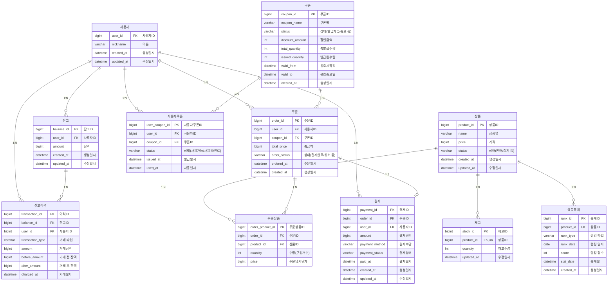

# E-커머스 서비스 ERD

**📚 문서 목록**

+ [1️⃣ 요구사항 분석 문서](00.Requirements.md)
+ [2️⃣ 마일스톤 문서](01.Milestones.md)
+ 3️⃣ 다이어그램 문서
  + [시퀀스 다이어그램 문서](02-1.SequenceDiagram.md)
  + [상태 다이어그램 문서](02-2.StateDiagram.md)
+ [4️⃣ ERD 문서](03.ERD.md)
+ [5️⃣ API 명세](04.ApiDocument.md)

---

<!-- TOC -->
* [E-커머스 서비스 ERD](#e-커머스-서비스-erd)
  * [의도 (Intent)](#의도-intent)
    * [테이블의 고유 식별자 구성](#테이블의-고유-식별자-구성)
    * [동시성 제어 컬럼](#동시성-제어-컬럼)
    * [Redis 사용지점](#redis-사용지점)
    * [관리자 성격의 상태 컬럼](#관리자-성격의-상태-컬럼)
  * [ERD 작성](#erd-작성)
  * [상태 및 타입 정의 (Status & Type)](#상태-및-타입-정의-status--type)
    * [거래 타입 (transaction_type)](#1-거래-타입-transactiontype)
    * [상품 상태 (product_status)](#2-상품-상태-productstatus)
    * [쿠폰 상태 (coupon_status)](#3-쿠폰-상태-couponstatus)
    * [사용자쿠폰 상태 (User_Coupon_Status)](#4-사용자쿠폰-상태-usercouponstatus)
    * [주문 상태 (Order_Status)](#5-주문-상태-orderstatus)
    * [결제 수단 (Payment_Method)](#6-결제-수단-paymentmethod)
    * [결제 상태 (Payment_Status)](#7-결제-상태-paymentstatus)
    * [기타 참고](#8-기타-참고)
<!-- TOC -->

## 생각&고민

### 테이블의 고유 식별자 구성

잔고와 사용자, 상품과 재고 테이블은 1:1 관계를 맺고 있어 하나로 합칠 수도 외래 키를 기본 키로 사용할 수 있으나,
도메인 독립성과 명확한 식별을 위해 별도의 ID 컬럼(고유 식별자)을 기본 키로 설계하였습니다.
또한 상품과 재고 테이블은 향후 상품의 옵션이 추가될 경우 도메인 관점에서 분리가 필요하다고 생각했습니다.

다만, 이 경우 조인 시 인덱스 활용이 제한되어 쿼리 성능 측면에서 불리할 수 있습니다.

### 동시성 제어 컬럼

잔고,쿠폰,재고,주문/결제는 동시성 제어가 필요한 주요 테이블입니다. 
동시 요청에 따른 데이터 정합성을 보장하기 위해 트랜잭션 처리 또는 분산 락과 같은 메커니즘이 필요합니다.

### Redis 사용지점
악의적인 사용자로 인해 주문 테이블의 데이터가 많아질것을 염려하여 Redis를 사용해 임시 데이터를 가지고 있는게 좋을 수 있다고 생각이 듭니다.

### 관리자 성격의 상태 컬럼

쿠폰 테이블의 스테이터스, 상품의 스테이터스를 제작하여 관리자가 직접 관리할 수 있도록 하고자 합니다.
또한 주문 테이블에 각 개인화된 테이블보다는 관리자 성격의 테이블을 묶는 것이 향후 정책/관리 측면에서 유리하다고 생각합니다.
위의 상태 컬럼은 [상태 및 타입 정의 (Status & Type)](#상태-및-타입-정의-status--type) 값 들로 관리됩니다.

## ERD 작성

## 상태 및 타입 정의 (Status & Type)

### 1. 거래 타입 (TransactionType)

잔고 변동(충전, 사용 등) 이력에 사용되는 거래 타입입니다.

| 값      | 설명         |
|---------|--------------|
| CHARGE  | 잔액 충전    |
| USE     | 잔액 사용    |

---

### 2. 상품 상태 (ProductStatus)

| 값         | 설명         |
|------------|--------------|
| SELLABLE   | 판매 가능    |
| UNSELLABLE | 판매 중지    |

---

### 3. 쿠폰 상태 (CouponStatus)

| 값        | 설명           |
|-----------|----------------|
| PUBLISHABLE  | 발급 가능      |
| ENDED     | 발급 종료      |
| EXPIRED   | 만료           |

---

### 4. 사용자쿠폰 상태 (UserCouponStatus)

| 값        | 설명           |
|-----------|----------------|
| UNUSED | 사용 가능      |
| USED      | 사용 완료      |
| EXPIRED   | 만료           |

---

### 5. 주문 상태 (OrderStatus)

| 값        | 설명           |
|-----------|----------------|
| PAID      | 결제 완료      |
| CANCELLED | 주문 취소      |
| PENDING   | 결제 대기      |

---

### 6. 결제 수단 (PaymentMethod)

| 값      | 설명         |
|---------|--------------|
| BALANCE | 잔고 결제    |
| CARD    | 카드 결제    |
| PG      | 외부 PG사    |

---

### 7. 결제 상태 (PaymentStatus)

| 값        | 설명           |
|-----------|----------------|
| READY   | 결제 준비      |
| WAITING   | 결제 대기      |
| SUCCESS   | 결제 성공      |
| FAILED    | 결제 실패      |
| CANCELLED | 결제 취소      |

---

### 8. 기타 참고

- **거래 타입(TransactionType)**은 잔고이력(충전, 사용, 환불 등)에 필수적으로 사용됩니다.
- **상태/타입 값**은 서비스의 비즈니스 로직과 확장성에 따라 추가/수정될 수 있습니다.
- 실제 구현 시에는 각 언어나 프레임워크의 enum, 상수, 코드 테이블 등으로 관리하면 됩니다.
