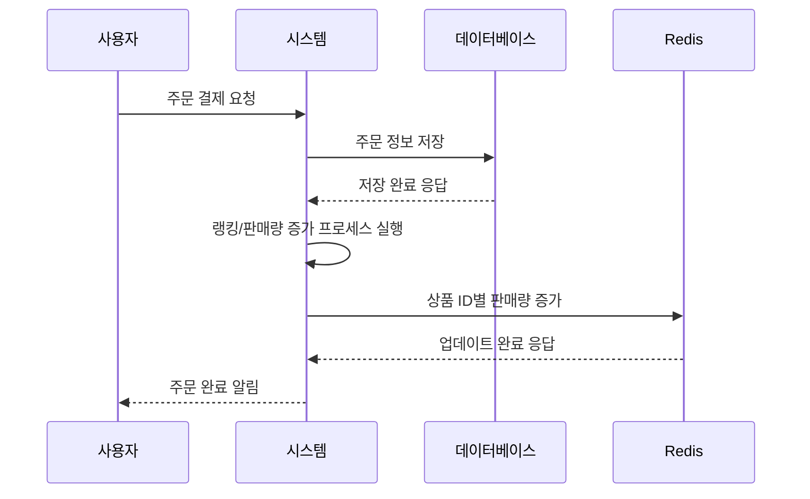
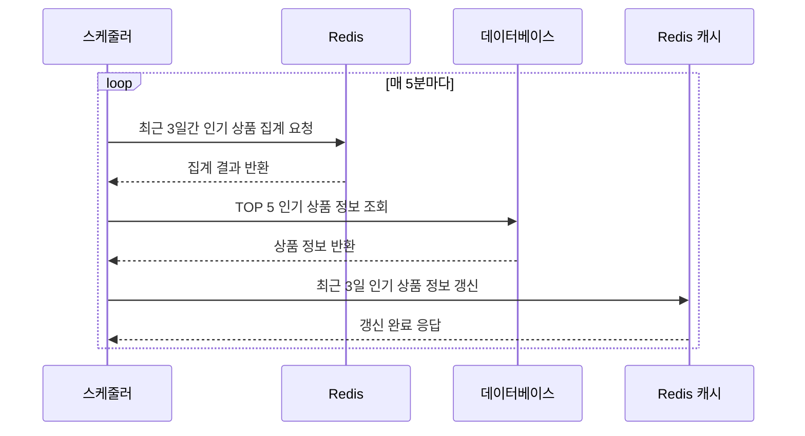
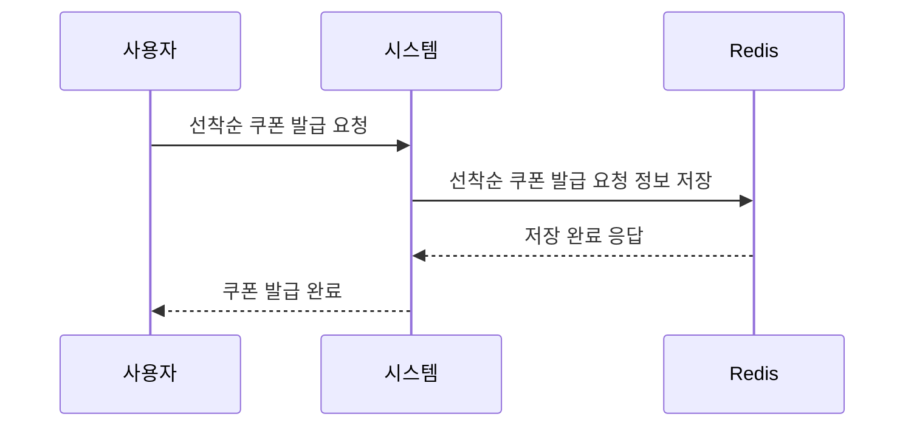
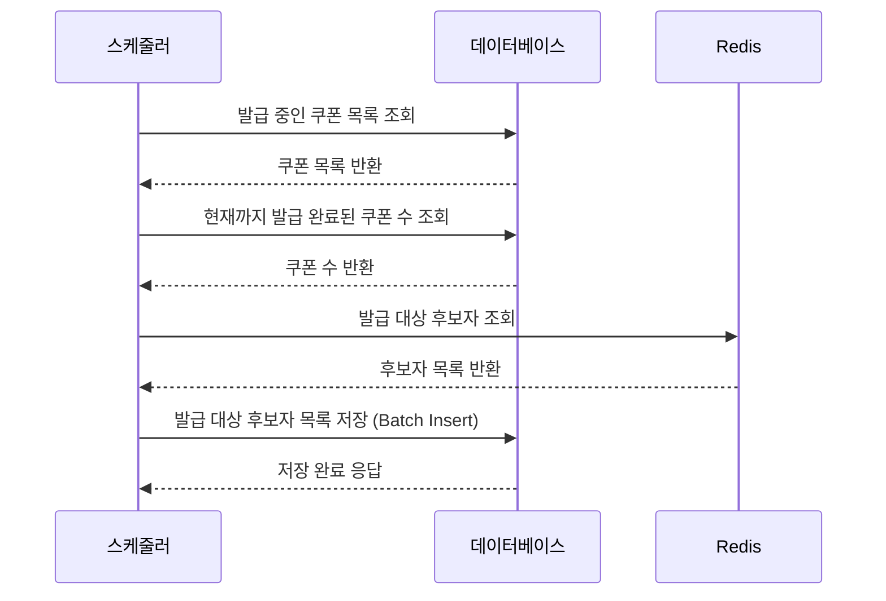

# Redis 설계 보고서

## 1. 배경

### 1.1 프로젝트 개요
이커머스 플랫폼에서 사용자 경험 향상과 시스템 성능 최적화를 위해 Redis를 도입했습니다. 특히 인기 상품 조회와 선착순 쿠폰 발급 기능에서 발생하는 성능 병목 현상을 해결하고자 했습니다.

### 1.2 문제점 분석
- **인기 상품 조회**: 매번 DB에서 복잡한 집계 쿼리를 실행하여 응답 시간이 길어짐
- **선착순 쿠폰 발급**: 동시성 문제로 인한 중복 발급 및 순서 보장 실패
- **시스템 부하**: 트래픽 증가 시 DB 부하가 급격히 증가

## 2. 대상선정 이유

### 2.1 인기 상품 조회
**선정 이유:**
- **빈번한 조회**: 사용자들이 자주 접근하는 기능
- **복잡한 집계**: 여러 날짜의 판매량을 집계하는 복잡한 쿼리
- **실시간성**: 최신 인기 상품 정보를 빠르게 제공해야 함
- **캐싱 효과**: 데이터가 자주 변경되지 않아 캐싱 효과가 큼

### 2.2 선착순 쿠폰 발급
**선정 이유:**
- **동시성 문제**: 수많은 사용자가 동시에 쿠폰 발급을 요청
- **순서 보장**: 선착순 원칙을 정확히 지켜야 함
- **성능 요구사항**: 빠른 응답 시간이 필수
- **데이터 일관성**: 중복 발급 방지와 정확한 순서 기록 필요

## 3. 설계

### 3.1 인기 상품 조회

#### 3.1.1 주문완료시 판매량 집계



**주문 완료 시점에서의 판매량 집계 처리:**

```java
// 주문 완료 시 Redis에 판매량 집계
@Transactional
public void createDailyRankAt(LocalDate date) {
    OrderCommand.DateQuery orderCommand = OrderCommand.DateQuery.of(date);
    OrderInfo.PaidProducts paidProducts = orderService.getPaidProducts(orderCommand);
    
    RankCommand.CreateList rankCommand = createListCommand(paidProducts, date);
    rankService.createSellRank(rankCommand);
}
```

**설계 포인트:**
- **실시간 집계**: 주문 완료 시점에 즉시 해당 상품의 판매량을 Redis Sorted Set에 반영
- **데이터 구조**: Key: `rank:sell:yyyyMMdd`, Score: 판매량, Value: 상품ID
- **증분 업데이트**: `incrementScore`를 사용하여 기존 판매량에 새로운 판매량을 누적
- **일별 분리**: 날짜별로 별도의 키를 사용하여 데이터 관리 용이성 확보

**Redis 저장 로직:**
```java
public Rank save(Rank rank) {
    String key = rank.toKey().generate();
    redisTemplate.opsForZSet().incrementScore(key, rank.getProductId(), rank.getScore());
    return rank;
}
```

#### 3.1.2 실시간 인기상품 스케줄러



**정기적인 인기 상품 랭킹 갱신 처리:**


```java
@Scheduled(cron = "0 */5 * * * *")
public void createDailyRank() {
    log.info("실시간 인기상품 캐싱 스케줄러 실행");
    try {
        rankFacade.updatePopularProducts(RankCriteria.PopularProducts.ofTop5Days3());
        log.info("실시간 인기상품 캐싱 스케줄러 완료");
    } catch (Exception e) {
        log.error("실시간 인기상품 캐싱 스케줄러 실행 중 오류 발생", e);
    }
}
```

**설계 포인트:**
- **주기적 갱신**: 5분마다 실행되어 최신 인기 상품 정보를 실시간으로 반영
- **데이터 통합**: 여러 날짜의 판매량 데이터를 UNION하여 통합 랭킹 생성
- **캐시 관리**: TTL 49시간으로 설정하여 안정적인 캐시 수명 보장
- **에러 처리**: 스케줄러 실행 중 오류 발생 시 로깅하여 모니터링 가능

**인기 상품 조회 로직:**
```java
@Cacheable(value = CacheType.CacheName.POPULAR_PRODUCT, key = "'top:' + #criteria.top + ':days:' + #criteria.days")
public RankResult.PopularProducts getPopularProducts(RankCriteria.PopularProducts criteria) {
    return getPopularProducts(criteria.getTop(), criteria.getDays());
}

@CachePut(value = CacheType.CacheName.POPULAR_PRODUCT, key = "'top:' + #criteria.top + ':days:' + #criteria.days")
public RankResult.PopularProducts updatePopularProducts(RankCriteria.PopularProducts criteria) {
    return getPopularProducts(criteria.getTop(), criteria.getDays());
}
```

#### 3.1.3 Redis 데이터 구조

**인기 상품 랭킹을 위한 Redis Sorted Set 활용:**

```java
// Key 구조: rank:sell:3days (3일간 인기 상품)
// Value: 상품ID, Score: 총 판매량
redisTemplate.opsForZSet().unionAndStore(sources.getFirstKey(), sources.getOtherKeys(), targetKey);
Set<TypedTuple<Long>> tuples = redisTemplate.opsForZSet().reverseRangeWithScores(targetKey, 0, command.getTop() - 1);
```

**데이터 구조 설계:**
- **일별 키**: `rank:sell:20241201`, `rank:sell:20241202` 등 날짜별로 분리
- **통합 키**: `rank:sell:3days` - 여러 날짜 데이터를 UNION하여 생성
- **정렬**: Score(판매량) 기준으로 내림차순 정렬하여 인기 상품 순위 결정
- **조회**: `reverseRangeWithScores`를 사용하여 Top-N 상품을 효율적으로 조회

**Redis 명령어 활용:**
```java
// 여러 날짜의 데이터를 하나로 통합
redisTemplate.opsForZSet().unionAndStore(targetKey, sources.getFirstKey(), sources.getOtherKeys());

// Top-N 상품 조회 (내림차순)
Set<TypedTuple<Long>> tuples = redisTemplate.opsForZSet().reverseRangeWithScores(targetKey, 0, command.getTop() - 1);
```

### 3.2 선착순 쿠폰 발급

#### 3.2.1 선착순 쿠폰 발급 요청 - Redis 저장



**사용자의 쿠폰 발급 요청을 Redis에 임시 저장:**

```java
public boolean save(UserCouponCommand.PublishRequest command) {
    UserCouponKey key = UserCouponKey.of(command.getCouponId());
    long score = command.getIssuedAt().toEpochSecond(ZoneOffset.UTC);
    
    return Boolean.TRUE.equals(redisTemplate.opsForZSet().addIfAbsent(key.generate(), command.getUserId(), score));
}
```

**설계 포인트:**
- **키 구조**: `user_coupon:{couponId}` - 쿠폰별로 별도의 Sorted Set 사용
- **Score 활용**: 발급 요청 시간을 Unix timestamp로 변환하여 Score로 사용
- **중복 방지**: `addIfAbsent`를 사용하여 동일 사용자의 중복 발급 요청 방지
- **순서 보장**: 시간 기반 정렬로 정확한 선착순 순서 보장
- **원자적 연산**: Redis의 원자적 연산으로 동시성 문제 해결

**동시성 제어 메커니즘:**
```java
// 사용자가 쿠폰 발급 요청 시
public void requestPublishUserCoupon(UserCouponCriteria.PublishRequest criteria) {
    userCouponService.requestPublishUserCoupon(criteria.toCommand(LocalDateTime.now()));
}
```

#### 3.2.2 선착순 쿠폰 발급 - DB 저장



**Redis의 선착순 데이터를 DB로 배치 이관 처리:**

```java
@Scheduled(cron = "0 * * * * *")
public void publishUserCoupon() {
    log.info("사용자 쿠폰 발급 등록 스케줄러 실행");
    try {
        userCouponFacade.publishUserCoupons(UserCouponCriteria.Publish.of(MAX_PUBLISH_COUNT_PER_REQUEST));
        log.info("사용자 쿠폰 발급 등록 스케줄러 완료");
    } catch (Exception e) {
        log.error("사용자 쿠폰 발급 등록 스케줄러 실행 중 오류 발생", e);
    }
}
```

**설계 포인트:**
- **주기적 처리**: 1분마다 실행되어 Redis의 선착순 데이터를 DB로 이관
- **배치 최적화**: 한 번에 최대 100개씩 처리하여 DB 부하 최소화
- **순서 보장**: Redis Sorted Set의 정렬된 순서를 그대로 DB에 반영
- **에러 처리**: 스케줄러 실행 중 오류 발생 시 로깅하여 모니터링

**배치 처리 로직:**
```java
public void publishUserCoupons(UserCouponCommand.Publish command) {
    int start = userCouponRepository.countByCouponId(command.getCouponId());
    int end = Math.min(command.getQuantity(), start + command.getMaxPublishCount());
    
    if (start >= command.getQuantity()) {
        log.info("발급할 쿠폰 수량이 없습니다. 쿠폰 ID : {}", command.getCouponId());
        return;
    }
    
    List<UserCouponInfo.Candidates> candidates = userCouponRepository
        .findPublishCandidates(UserCouponCommand.Candidates.of(command.getCouponId(), start, end));
    
    List<UserCoupon> coupons = candidates.stream()
        .map(uc -> UserCoupon.create(uc.getUserId(), command.getCouponId(), uc.getIssuedAt()))
        .toList();
    
    userCouponRepository.saveAll(coupons);
}
```

#### 3.2.3 선착순 쿠폰 발급 종료

```mermaid
♻️ 매 5분마다 스케줄러 실행

(1) 발급 중인 쿠폰 목록을 조회한다.
(2) 발급 완료된 쿠폰 수를 조회한다.
(3) 발급이 완료된 경우, 쿠폰 상태를 “FINISHED”로 변경하여 발급을 종료한다.
```

**쿠폰 발급 완료 시점 감지 및 마감 처리:**

```java
@Scheduled(cron = "30 */5 * * * *")
public void finishedPublishCoupons() {
    log.info("쿠폰 발급 마감 스케줄러 실행");
    try {
        userCouponFacade.finishedPublishCoupons();
        log.info("쿠폰 발급 마감 스케줄러 완료");
    } catch (Exception e) {
        log.error("쿠폰 발급 마감 스케줄러 실행 중 오류 발생", e);
    }
}
```

**설계 포인트:**
- **주기적 확인**: 5분마다 실행되어 발급 완료된 쿠폰을 감지하고 마감 처리
- **수량 검증**: 발급된 쿠폰 수량과 목표 수량을 비교하여 정확한 마감 판단
- **상태 변경**: 쿠폰 상태를 PUBLISHABLE에서 FINISHED로 변경하여 추가 발급 방지
- **에러 처리**: 스케줄러 실행 중 오류 발생 시 로깅하여 모니터링

**마감 처리 로직:**
```java
public void finishedPublishCoupons() {
    CouponInfo.PublishableCoupons coupons = couponService.getPublishableCoupons();
    
    coupons.getCoupons().stream()
        .map(p -> UserCouponCommand.PublishFinish.of(p.getCouponId(), p.getQuantity()))
        .filter(userCouponService::isPublishFinished)
        .forEach(p -> couponService.finishCoupon(p.getCouponId()));
}

public boolean isPublishFinished(UserCouponCommand.PublishFinish command) {
    int publishedCount = userCouponRepository.countByCouponId(command.getCouponId());
    
    if (publishedCount > command.getQuantity()) {
        log.error("발급된 쿠폰 개수가 발급 가능 개수를 초과했습니다. 쿠폰 ID: {}", command.getCouponId());
    }
    
    return publishedCount >= command.getQuantity();
}
```

## 4. 테스트

### 4.1 인기 상품 조회 테스트

#### 4.1.1 캐시 동작 테스트
```java
@DisplayName("인기 상품을 캐싱 조회 한다.")
@Test
void getPopularProducts() {
    // given
    Optional<RankResult.PopularProducts> emptyCached = redisCacheTemplate.get(CacheType.POPULAR_PRODUCT, cacheKey, RankResult.PopularProducts.class);
    
    // when
    rankFacade.getPopularProducts(RankCriteria.PopularProducts.ofTop5Days3());
    
    // then
    assertThat(emptyCached).isEmpty();
    
    RankResult.PopularProducts cached = redisCacheTemplate.get(CacheType.POPULAR_PRODUCT, cacheKey, RankResult.PopularProducts.class).orElseThrow();
    assertThat(cached.getProducts()).hasSize(3)
        .extracting("productId")
        .containsExactly(product3.getId(), product2.getId(), product1.getId());
}
```

#### 4.1.2 통합 테스트
```java
@DisplayName("인기 상품을 조회하고, 캐시를 갱신한다.")
@Test
void updatePopularProducts() {
    // given - 여러 날짜의 판매 데이터 생성
    
    // when
    RankResult.PopularProducts products = rankFacade.updatePopularProducts(RankCriteria.PopularProducts.ofTop5Days3());
    
    // then
    RankKey rankKey = RankKey.ofDays(RankType.SELL, 3);
    Long size = redisTemplate.opsForZSet().size(rankKey.generate());
    assertThat(size).isEqualTo(5);
    
    assertThat(products.getProducts()).hasSize(5)
        .extracting("productId")
        .containsExactly(product1.getId(), product5.getId(), product2.getId(), product3.getId(), product4.getId());
}
```

### 4.2 선착순 쿠폰 발급 테스트

#### 4.2.1 동시성 테스트
```java
@DisplayName("동시에 선착순 발급 요청 시, 모든 요청에 대해 발급 요청이 되어야 한다.")
@Test
void requestPublishUserCoupon() {
    // given
    Long couponId = 1000L;
    AtomicInteger successCount = new AtomicInteger();
    AtomicInteger failCount = new AtomicInteger();
    
    // when - 3000명이 동시에 쿠폰 발급 요청
    executeConcurrency(LongStream.range(0, 3000)
        .mapToObj(userId -> (Runnable) () -> {
            try {
                userCouponFacade.requestPublishUserCoupon(UserCouponCriteria.PublishRequest.of(userId, couponId));
                successCount.incrementAndGet();
            } catch (Exception e) {
                failCount.incrementAndGet();
            }
        }).toList()
    );
    
    // then
    assertThat(successCount.get()).isEqualTo(3000);
    assertThat(failCount.get()).isZero();
    
    Long size = redisTemplate.opsForZSet().size(UserCouponKey.of(couponId).generate());
    assertThat(size).isEqualTo(3000);
}
```

#### 4.2.2 중복 발급 방지 테스트
```java
@DisplayName("동시에 선착순 발급 시, 중복으로 발급 요청할 수 없다.")
@Test
void requestPublishUserCouponDuplicate() {
    // given
    Long userId = 1L;
    Long couponId = 1000L;
    
    // when - 같은 사용자가 동시에 여러 번 요청
    executeConcurrency(List.of(
        () -> userCouponFacade.requestPublishUserCoupon(UserCouponCriteria.PublishRequest.of(userId, couponId)),
        () -> userCouponFacade.requestPublishUserCoupon(UserCouponCriteria.PublishRequest.of(userId, couponId)),
        () -> userCouponFacade.requestPublishUserCoupon(UserCouponCriteria.PublishRequest.of(userId, couponId))
    ));
    
    // then - Redis에는 하나만 저장되어야 함
    Long size = redisTemplate.opsForZSet().size(UserCouponKey.of(couponId).generate());
    assertThat(size).isEqualTo(1);
}
```

## 5. 한계

- **Redis 장애 시 복구**: Redis 서버 장애 시 데이터 손실 가능성
- **메모리 사용량**: 대용량 데이터 처리 시 메모리 부족 위험 => Redis의 한정된 인메모리 기반 데이터베이스로 인해. 성능 정하 및 데이터 손실이 발생할 수 있다. 특히, 분산 락 키에 대한 데이터 손실이 발생할 경우, 이는 시스템 전체 장애로 이어질 수 있는 심각한 리스크가 된다.
- **쿠폰 발급**: 설계된 선착순 쿠폰 발급 방식은, 정해진 발급 수량만 저장하는 것이 아니라 모든 요청을 Redis에 저장하는 구조이기 때문에 메모리 효율성 측면에서 한계가 존재한다. 그리고 사용자 입장에서는 요청 즉시 발급 완료가 아니라, 요청 후 발급이 지연되기 때문에 사용자 경험(UX). 측면에서도 불편함이 있을 수 있다.


## 6. 결론

**인기 상품 조회와 선착순 쿠폰 발급 기능 모두에서 고성능과 고가용성을 확보할 수 있었다**

또한, Redis의 다양한 자료구조(ZSET)를 적절히 활용하여,
단순 캐싱을 넘어 데이터 집계, 순위 계산, 선착순 관리 등 RDB를 통한 복잡한 비지니스 로직을 효율적으로 처리할 수 있었다.

다만, Redis는 메모리 기반이라는 특성상 몇 가지 한계가 존재한다.
특히 대규모 트래픽 환경에서는 메모리 부족에 따른 성능 저하, 데이터 손실 위험, 데이터 영속성 문제에 대한 대비가 필요하다.

### 6.1 성과
- **성능 향상**: 인기 상품 조회 응답 시간 대폭 단축
- **동시성 해결**: 선착순 쿠폰 발급의 정확한 순서 보장
- **시스템 안정성**: DB 부하 감소로 전체 시스템 안정성 향상

### 6.2 개선 방향
- **백업 전략 수립**: 데이터 손실 방지를 위한 백업 체계 구축

### 6.3 학습 내용
- **Redis Sorted Set 활용**: 순서가 중요한 데이터 처리에 효과적
- **동시성 제어**: Redis의 원자적 연산을 활용한 동시성 문제 해결
- **캐싱 전략**: 적절한 TTL 설정과 스케줄러를 통한 캐시 갱신

Redis 도입을 통해 시스템 성능과 사용자 경험을 크게 개선할 수 있었으며, 앞으로 지속적인 모니터링과 개선을 통해 더욱 안정적이고 확장 가능한 시스템을 구축할 예정입니다.
