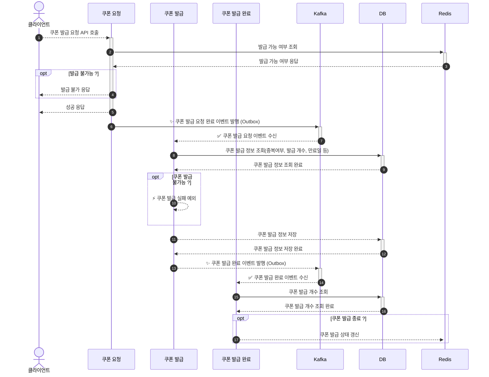

# Kafka 디자인 아키텍처 보고서

## 🖼️ 배경

기존 쿠폰 발급 시스템은 Redis의 **원자성 보장**과 **빠른 처리 속도**를 활용해 구현되어 있었다.

그러나, **즉시 발급이 아닌 배치 기반의 발급 프로세스**로 인해  
사용자 관점에서는 **쿠폰 발급 지연** 문제가 발생했다.

현업 관점으로는 사용자 경험(UX)을 최우선으로 고려하기 때문에 **즉시성 있는 발급 처리**가 필요했다.

이를 해결하기 위해 **Kafka 기반 아키텍처**를 도입하여,  
쿠폰 발급을 **순차 처리 및 즉시 발급** 가능한 구조로 개선하고자 했다.

## 🛠️ Kafka 기반 전략

Kafka를 활용해 쿠폰 발급 시스템을 개선하기 위한 핵심 설계 요소는 **Topic 구조와 Partition 전략**이며,  
다음 두 가지 방식을 고려하였다.

---

### 1) 파티션 키를 쿠폰 ID로 설정

- **Topic**: `outside.coupon.publish.requested.v1`
- **Key**: `쿠폰 ID`
- **Partition 수**: 1개 (쿠폰 ID 별로 1개 파티션)

**쿠폰 ID를 파티션 키로 사용**하면, 동일 쿠폰에 대한 요청이 **항상 동일 파티션으로 라우팅**된다.  
이를 통해 **순차 처리**가 가능하며 구현이 단순하다.

**장점**:

- 동일 쿠폰에 대한 요청 순서를 보장
- 구현이 간단하고 토픽이 고정됨

**단점**:

- 파티션이 1개라서 **병렬 처리 불가**
- 처리량 확장에 한계가 있음

---

### 2) 토픽을 쿠폰 ID로 분리하여 설정

- **Topic**: `outside.coupon.publish.requested.v1.{couponId}`
- **Key**: 없음
- **Partition 수**: 여러 개

쿠폰 ID마다 **별도의 Topic을 생성**하여 요청을 라우팅한다.  
이 방식은 **토픽 단위로 격리되므로 순차성과 병렬 처리**를 모두 확보할 수 있다.

**장점**:

- 파티션을 자유롭게 구성 가능
- 쿠폰별로 처리량을 독립적으로 확장 가능

**단점**:

- **매 쿠폰마다 토픽 생성** 필요
- 운영 및 관리 복잡도 상승
- Kafka 클러스터에 과도한 Topic 증가 우려

---

### 선택된 전략: 파티션 키 방식

복잡도를 고려하여, 본 시스템에서는 **"파티션 키를 쿠폰 ID로 설정"하는 방식**을 채택하였다.  
이는 대부분의 Kafka 기반 시스템에서 일반적으로 사용되며, **일정 수준의 처리량과 순차 처리 보장**이 가능한 현실적인 전략이다.

---

### 토픽 명 버저닝 전략

Kafka의 **Partition 수는 생성 이후 변경이 불가능**하므로,  
처리량 증가에 대비해 다음과 같은 버저닝 전략을 사용한다.

> 예 : `outside.coupon.publish.requested.v1` → `outside.coupon.publish.requested.v2`

**토픽을 버전 업**하여 새로운 파티션 수를 적용하고, 기존 프로듀서/컨슈머를 점진적으로 마이그레이션한다.

## 🏗️ Kafka 기반 설계

쿠폰 발급 요청 API 호출 시, Redis를 통해 **발급 가능 여부만 조회**하고,  
쿠폰 발급 요청 완료 이벤트를 Kafka에 발행하여 **선착순 처리와 동시성 문제를 해결**한다.

기존에는 Redis가 쿠폰 발급 로직 전반을 관리하였으나,  
이제는 **단순 조회 용도로만 제한함으로써 Redis의 부담을 줄이고, Kafka를 통해 처리 분산과 고가용성**을 확보한 설계를 진행하였다.

### Kafka 기반 쿠폰 발급 시스템 아키텍처


#### 1) 발급 가능 여부 확인

쿠폰 발급 요청 시, Redis에서 쿠폰 발급 가능 여부를 조회한다.

- 발급 가능 : 쿠폰 발급 요청 완료 이벤트를 Kafka에 발행하고, 클라이언트에 성공 응답을 반환한다.
- 발급 불가 : 클라이언트에 발급 불가 응답을 반환한다.

```lua
GET coupon:available:{couponId}
```

#### 2) 쿠폰 발급 요청 완료 이벤트 발행

Kafka에 쿠폰 발급 요청 완료 이벤트를 발행한다.  
이때 이벤트의 발행을 보장하기 위해 Outbox 패턴을 사용한다.

#### 3) 쿠폰 발급 정보 조회 및 저장

쿠폰 발급 요청 완료 이벤트를 수신한 쿠폰 발급 서비스는  
DB에서 쿠폰 발급 정보를 조회하여 중복 여부, 발급 개수, 만료일 등을 확인한다. (멱등성 보장)

발급이 가능한 경우, 쿠폰 발급 정보를 DB에 저장한다.

#### 4) 쿠폰 발급 완료 이벤트 발행

쿠폰 발급이 완료되면,
도메인 이벤트(ApplicationEvent)로 쿠폰 발급 완료 이벤트를 발행한다.

#### 5) 쿠폰 발급 상태 갱신

쿠폰 발급 완료 이벤트를 수신한 쿠폰 발급 완료 서비스는 DB에서 쿠폰 발급 개수를 조회하며,  
발급 개수가 0이면, Redis에 쿠폰 발급 상태를 갱신한다.

```lua
SET coupon:available:{couponId} false
```

### Kafka 기반 쿠폰 발급 시스템 시퀀스 다이어그램

위의 그림을 시퀀스 다이어그램으로 표현하면 다음과 같다.



## ✨ Kafka 기반 구현

### 1) 쿠폰 발급 요청 서비스

쿠폰 발급 여부를 확인하고 **쿠폰 발급 요청 완료 이벤트**(Kafka 이벤트 - Outbox)를 Kafka에 발행하는 서비스이다.

```java
public class CouponService {

    public void requestPublishUserCoupon(CouponCommand.Publish command) {
        boolean publishable = couponRepository.findPublishableCouponById(command.getCouponId());

        if (!publishable) {
            throw new IllegalArgumentException("발급 불가한 쿠폰입니다.");
        }

        CouponEvent.PublishRequested event = CouponEvent.PublishRequested.of(command.getUserId(), command.getCouponId());
        couponEventPublisher.publishRequested(event);
    }
}
```

이 메서드는 `@Transactional`을 사용할 수 없기 때문에 `OutboxEvent.Manual`로 발행되며,  
`@Async + @EventListener` 방식으로 Outbox를 DB에 저장하고 Kafka에 발행한다.

> 자세한 내용은 [Kafka - Outbox 패턴 적용](/docs/study/01.Kafka.md) 참고

#### 쿠폰 발급 요청 도메인 이벤트 발행

```java
public class CouponEventPublisherImpl implements CouponEventPublisher {

    private final OutboxEventPublisher outboxEventPublisher;

    @Override
    public void publishRequested(CouponEvent.PublishRequested event) {
        outboxEventPublisher.publishManualEvent(EventType.COUPON_PUBLISH_REQUESTED, event.getCouponId(), event);
    }
}
```

#### 아웃박스 이벤트 리스너

```java
public class OutboxEventListener {

    private final OutboxService outboxService;

    @Async
    @EventListener
    public void handle(OutboxEvent.Manual event) {
        log.info("produceEvent - Manual 아웃 박스 이벤트 수신: {}", event.getOutbox().getTopic());
        outboxService.createOutbox(event.getOutbox());
        outboxService.produceEvent(event.getOutbox());
    }
}
```

### 2) 쿠폰 발급 요청 완료 이벤트 수신

Kafka를 통해 발행된 이벤트를 `@KafkaListener`가 수신하여
쿠폰 발급을 진행하고, 완료되면 offset을 수동 커밋한다.

```java
public class CouponMessageEventListener {

    @KafkaListener(topics = Topic.COUPON_PUBLISH_REQUESTED, groupId = GroupId.COUPON)
    public void handle(String message, Acknowledgment ack) {
        log.info("쿠폰 발급 요청 이벤트 수신 {}", message);

        Event<CouponEvent.PublishRequested> event = Event.of(message, CouponEvent.PublishRequested.class);
        CouponEvent.PublishRequested payload = event.getPayload();

        couponService.publishUserCoupon(CouponCommand.Publish.of(payload.getUserId(), payload.getCouponId()));
        ack.acknowledge();
    }
}
```

### 3) 쿠폰 발급

중복 발급을 방지하고, 쿠폰 개수 및 만료일 등을 검증한 후 발급을 진행한다.  
정상 발급 후에는 도메인 이벤트로 발급 완료 이벤트를 발행한다.

```java
public class CouponService {

    @Transactional
    public void publishUserCoupon(CouponCommand.Publish command) {
        couponRepository.findByUserIdAndCouponId(command.getUserId(), command.getCouponId())
            .ifPresent(coupon -> {
                throw new IllegalArgumentException("이미 발급된 쿠폰입니다.");
            });

        Coupon coupon = couponRepository.findCouponById(command.getCouponId());
        coupon.publish();

        UserCoupon userCoupon = UserCoupon.create(command.getUserId(), command.getCouponId());
        couponRepository.save(userCoupon);

        CouponEvent.Published event = CouponEvent.Published.of(coupon);
        couponEventPublisher.published(event);
    }
}
```

### 4) 쿠폰 발급 완료 이벤트 수신

발급 완료 도메인 이벤트를 수신하여, Redis 상태를 변경하는 메서드를 호출한다.

```java
public class CouponEventListener {

    private final CouponService couponService;

    @Async
    @TransactionalEventListener
    public void handle(CouponEvent.Published event) {
        log.info("쿠폰 발행 이벤트 수신 - 쿠폰 발행");
        couponService.stopPublishCoupon(event.getId());
    }
}
```

### 5) 쿠폰 발급 상태 갱신

DB에서 쿠폰 상태를 조회하고, 더 이상 발급 불가능할 경우 Redis 상태를 변경한다.

```java
public class CouponService {

    @Transactional(readOnly = true)
    public void stopPublishCoupon(Long couponId) {
        Coupon coupon = couponRepository.findCouponById(couponId);

        if (coupon.isNotPublishable()) {
            couponRepository.updateAvailableCoupon(couponId, false);
        }
    }
}
```

## 🧪 테스트

Kafka 기반 쿠폰 발급 시스템의
테스트는 [Awaitility](https://testcontainers.com/guides/testing-spring-boot-kafka-listener-using-testcontainers/#_write_test_for_kafka_listener)
를 활용하여 진행하였다.    
쿠폰 발급 완료 이벤트가 정상적으로 발행되고, DB에 저장되었는지를 비동기적으로 검증한다.

```java
class CouponControllerE2ETest extends E2EControllerTestSupport {

    @DisplayName("쿠폰을 발급한다.")
    @Test
    void publishCoupon() {
        // given
        Coupon coupon = Coupon.create("쿠폰명1", 0.1, 10, CouponStatus.PUBLISHABLE, LocalDateTime.now().plusDays(1));
        couponRepository.save(coupon);
        couponRepository.updateAvailableCoupon(coupon.getId(), true);

        CouponRequest.Publish request = CouponRequest.Publish.of(coupon.getId());

        // when & then
        given()
            .contentType(ContentType.JSON)
            .body(request)
            .when()
            .post("/api/v1/users/{id}/coupons/publish", user.getId())
            .then()
            .log().all()
            .statusCode(HttpStatus.OK.value())
            .body("code", equalTo(200))
            .body("message", equalTo("OK"));

        await()
            .atMost(30, TimeUnit.SECONDS)
            .pollInterval(Duration.ofMillis(500))
            .untilAsserted(() -> {
                Optional<UserCoupon> result = couponRepository.findByUserIdAndCouponId(user.getId(), coupon.getId());
                assertThat(result).isPresent();
            });
    }
}
```

### 테스트 설명 및 확인

`Awaitility`를 사용하여 **30초 이내, 500ms 간격**으로 폴링하여 쿠폰 발급 완료 여부를 검증한다.

해당 테스트는 **쿠폰 발급 완료 이벤트가 정상적으로 처리되었는지**와 함께,  
**발급 가능 수량이 1개일 경우**, Redis의 발급 상태 (`coupon:available:{couponId}`)가 `false`로 갱신되었는지를 확인하는 **E2E 테스트**이다.

### 테스트 결과

아래 이미지처럼 쿠폰 발급 이벤트가 정상적으로 발행되고,
테스트가 성공된 것을 확인할 수 있다.


## 🆚 Redis 기반 vs Kafka 기반 시스템 비교

| 항목            | Redis 기반          | Kafka 기반        |
|---------------|-------------------|-----------------|
| **처리 방식**     | 이벤트 기반 비동기 처리     | 이벤트 기반 비동기 처리   |
| **발급 지연**     | 평균 1분 (배치 의존)     | 실시간 발급 가능       |
| **DB 부하**     | 배치 기반 Bulk Insert | 발급 단건 처리로 분산    |
| **Redis 사용량** | 쿠폰 발급 요청 정보 전체 저장 | 발급 가능 여부 조회만 사용 |
| **운영 편의성**    | 배치 관리 필요          | 배치 제거로 운영 단순화   |

Kafka 기반 시스템은 성능뿐 아니라 **운영 효율성**과 **사용자 경험(UX)** 향상까지 동시에 달성하였다.

## 🏁 결론

Kafka 기반 아키텍처를 도입함으로써 다음과 같은 효과를 얻을 수 있었다.

- **즉시 발급 가능**한 사용자 친화적인 쿠폰 시스템 구현
- **배치 제거**를 통한 운영 간소화 및 장애 지점 감소
- **DB 및 Redis의 부하 감소**, 시스템 전반의 안정성 확보
- **Outbox 패턴과 멱등성 보장**으로 메시지 신뢰성 향상

결과적으로 **선착순 쿠폰 발급의 핵심 요건인 동시성 제어와 고가용성**을 만족할 수 있는 시스템을 구축하였다.


